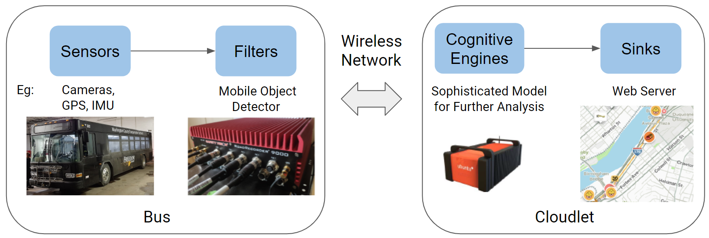
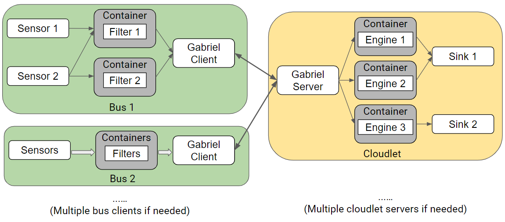

<!--
SPDX-FileCopyrightText: 2021 Carnegie Mellon University

SPDX-License-Identifier: Apache-2.0
-->

# BusEdge Platform

1. [Demo](demo)
2. [Client](client)
3. [Server](server)
4. [How to use collected rosbag data](./client/scripts/use_rosbag)
5. [How to launch the BusEdge client at startup](./client/scripts/run_on_bus)

## Overview



The BusEdge platform is the system we build to analyze the data stream
freshly-captured from the transit buses in a scalable and responsive
manner. It contains four major components: Sensors and Early-Discard Filters on
the bus (client) side as well as Cognitive Engines and Sinks on the cloudlet
(server) side.

**Sensors** are the data sources on the bus, which usually include video
streams from multiple cameras, GPS, accelerometer and other vehicle status read
from the CANBUS. These sensor inputs will be firstly preprocessed and then
published to different Early-Discard Filters for refinement.

**Early-Discard Filters** represent the data refinement components running on
the edge computer. Different tasks could share the same filtering node or have
different ones. Each filter is mutually independent and will send its outputs
to the specific Cognitive Engine on the cloudlet for further analysis.

**Cognitive Engines** are the computer vision modules running on the cloudlet
to handle and analyze the filtered messages from the bus client. The flow control
between the bus client and the cloudlet server is managed by
[Gabriel](https://github.com/cmusatyalab/gabriel).

**Sinks** represent the final components on the cloudlet to collect all the
results from different Cognitive Engines and do the data analytics and
visualization. This could be an OpenStreetMap server to simply show all the
detection results on a map or some toolboxes for data
analytics and visualization.

## System Architecture



Modular design is one important feature of the BusEdge platform to realize
scalability. The flow control of the pipeline is transparent to the developers
and they only need to develop their own early-discard filter and cognitive
engine. Each early-discard filter and cognitive engine could run in their own
docker container both on the bus client and the cloudlet server. We isolate the
functionality modules including cognitive engines and early-discard filters
into different docker containers because we want to enable rapid functionality
expansion and avoid dependency conflicts.

## Citations
Please cite the following thesis if you find this useful.
  ```
  @mastersthesis{Ye-2021-128891,
  author = {Canbo Ye},
  title = {BusEdge: Efficient Live Video Analytics for Transit Buses via Edge Computing},
  year = {2021},
  month = {July},
  school = {},
  address = {Pittsburgh, PA},
  number = {CMU-RI-TR-21-46},
  }
  ```

## License

- All original source code and documentation are licensed under the
  [Apache License, Version 2.0](https://www.apache.org/licenses/LICENSE-2.0.html).
- Some configuration and trivial data files are licensed under CC0-1.0.
- Non-original source files were Apache-2.0, BSD-3-Clause, BSD-2-Clause, or MIT
  licensed and retain their original licensing.

A copy of all licenses is provided in the `LICENSES/` folder, it is possible to
create a bill of materials, which licenses various files use, with a tool like
[reuse](https://reuse.software).
