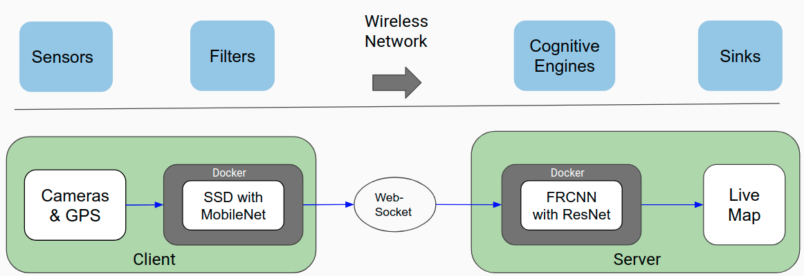
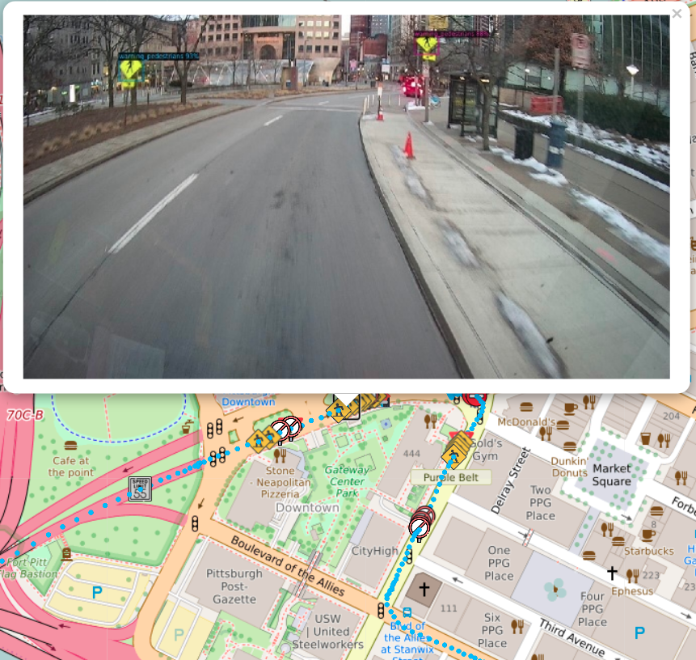

<!--
SPDX-FileCopyrightText: 2021 Carnegie Mellon University

SPDX-License-Identifier: Apache-2.0
-->

# A Bus-Edge Pipeline Demo

## Overview

This BusEdge pipeline demo is to detect the traffic signs while the bus is
driving and show them on the map. As is shown in the following figure, we will
first have a lightweight traffic sign detector on the client side to filter the
raw input, then have further analysis on the server and finally show the
results on the map based on the GPS.



## Installation

- On the Server: see [Server Dependencies](../server/README.md/#install-dependencies).
  The LiveMap web server is needed if we want to visualize the results on a web
  page. You could also skip that if you only want to see how the pipeline works.
- On the Client: see [Client Dependencies](../client/README.md/#install-dependencies).

## Launch the Pipeline

### On the Server

- Download the pretrained traffic sign detector model from this
  [link](https://drive.google.com/drive/folders/1kO9c3BQtAWeBVQN8p3Yhq0NuJscrG5Uf?usp=sharing)
  and unzip the files:

    ```sh
    unzip sign_detector.zip -d engines/detector_docker/model
    ```

- Launch the Gabriel server in a terminal:

    ```sh
    python3 run_server.py
    ```

- Launch the Cognitive Engine inside a docker container in another terminal:

    ```sh
    # Build a docker image for the engine
    cd engines/detector_docker
    docker build --build-arg USER_ID=${UID} -t detector_engine .
    # Run the engine in a docker container
    docker run --gpus all -v "$PWD":/home/appuser/gabriel_server --rm -it \
        detector_engine python3 engine_runner.py --save-raw
    ```

  This engine will save all the received images with GPS as exif data into
  `./raw_images` and the detection results into `./images`. Add `--use-livemap`
  if the LiveMap web server is enabled.

### On the Client

- Launch ROS master by running `roscore` in a terminal.
- Download the demo rosbag data from this
  [link](https://drive.google.com/drive/folders/1kO9c3BQtAWeBVQN8p3Yhq0NuJscrG5Uf?usp=sharing)
  and play it in another terminal. This can simulate the real-time bus data. See
  [How to use collected rosbag data](../client/scripts/use_rosbag) for more
  details and tools.

    ```sh
    rosbag play demo_data.bag
    ```

- Download the pretrained SSD model from this
  [link](https://drive.google.com/drive/folders/1kO9c3BQtAWeBVQN8p3Yhq0NuJscrG5Uf?usp=sharing)
  and unzip the files:

    ```sh
    unzip ssd_mobilenet_v1_mtsd_hunter.zip -d nodes/detector_docker/model
    ```

- Set the Gabriel server IP address as an environment variable:

    ```sh
    export GABRIEL_SERVER_IP_ADDRESS={your_server_address}
    ```

    ```sh
    # Or add it to .bashrc (optional)
    echo "export GABRIEL_SERVER_IP_ADDRESS={your_server_address}" >> ~/.bashrc
    source ~/.bashrc
    ```

- Then launch the Gabriel client in this terminal:

    ```sh
    cd client
    python3 run_client.py --source-name sign_filter3
    # sign_filter3 is the source name of the pipeline
    # and the last digit "3" is the camera id.
    ```

- Launch the Early Discard Filter in a docker container for this pipeline:

    ```sh
    # Build a docker image for the engine
    cd nodes/detector_docker
    docker build -t detector . # You might need sudo
    # Run the engine in a docker container
    docker run --net=host --rm -it detector python3 sign_filter_node.py
    ```

## Results shown on the LiveMap



If LiveMap web server is not enabled, you can still find the received raw
images tagged with GPS in `./raw_images` and the detection results in
`./images`.
